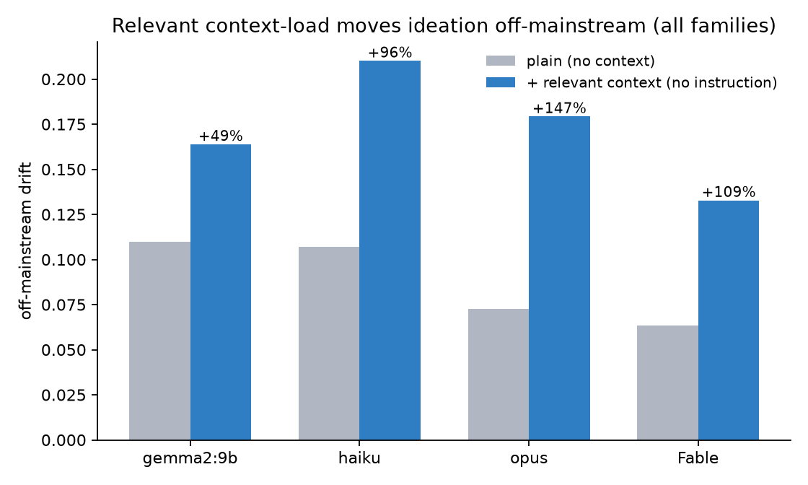

# Relevant Context-Load as a Saturating Novelty Knob in Language Models: A Cross-Family Study

**Authors:** Cristian Ruvalcaba and the Saluca Agentic AI Research Team · Saluca Labs · cristian@saluca.com
**Draft — preprint, 2 July 2026.**

---

## Abstract

Does the amount of *relevant context* placed in a language model's window act as a knob on the **novelty** of its output, and if so is there an optimal input-to-window ratio? We test this with a controlled ideation task, embedding-based novelty and groundedness metrics, and four models spanning two orders of magnitude of capability (a 9-billion-parameter open model through a frontier model). We find three things. **(1)** Injecting relevant material as neutral reference — with *no* instruction to be original — reliably pushes ideation off the mainstream answer, and the effect replicates across every model family tested (+49% to +147% over an unprompted baseline) while groundedness is largely preserved. An isolation design rules out the obvious confound that the effect is merely the model obeying an implicit "be different" instruction. **(2)** The effect is a **saturating switch, not a tunable dial**: novelty rises over the first few hundred tokens of relevant context and then plateaus. There is no optimal ratio — the saturation is an *absolute* threshold of a few hundred tokens, which is 15% of a 4K window but a negligible 0.15% of a 200K window. **(3)** This threshold is essentially **invariant to model scale**; if anything the stronger model saturates *sooner* (~300 vs ~800 tokens), extracting the full benefit from less context, and is more anchored at baseline. The practical implication is clean: a few hundred tokens of relevant context captures the novelty benefit, and more adds nothing. A blinded human-rating pass finds groundedness **flat across the entire load range** — no coherence cost from load — and, in doing so, exposes a methodological caution worth its own emphasis: two automated groundedness judges (a fast local model and a strong frontier model) correlate **near zero** with the human rater (r = −0.12 and 0.00) and are systematically lenient (means 0.85 and 0.77 vs the human's 0.45), and they even disagree with each other on the load trend. Absolute groundedness scores from any single LLM judge should therefore be distrusted; only the *load-invariance* — on which the human and the weak judge agree — is robust. All code, prompts, and data are released.

## 1. Introduction

A companion line of work began with a replication of a recent claim about "world-model collapse" in long-horizon language agents. We found that the paper's stress axis conflated two variables — the *number of entities* in a task and the *token-length* of the state description — and that token-length alone was a sufficient, independent driver of the reported degradation. That result reframed context-length not as an incidental cost but as an active force on model behavior, and raised a sharper question: if long context *degrades* fidelity in a tracking task, might it also *change* the character of generative output — specifically, its novelty?

The intuition is an "edge-of-chaos" one: perhaps loading the context perturbs the model's high-probability, conventional response toward the fringe, and there exists an optimal load — a ratio of input to window — that maximizes novel-but-grounded output before coherence breaks down. This paper tests that intuition directly and reports where it holds, where it fails, and the clean empirical picture that replaces it.

## 2. Methods

**Task.** A single fixed ideation prompt across three neutral domains (a testable hypothesis for why biological sleep is necessary; a new note-taking-app feature; a growth strategy for a coffee roaster). Each domain has an obvious "mainstream" answer to diverge from and room for grounded novelty. The model is asked for one original, specific, concrete idea in one or two sentences.

**Load conditions (isolation design).** For each domain and seed we generate four conditions to separate *load* from *instruction*:
- `plain` — the task alone (baseline).
- `content` — a list of mainstream ideas injected as neutral **reference material**, with **no** instruction to differ.
- `instruction` — an explicit "be clearly different from the usual approaches," with **no** list.
- `functional` — both list and instruction.
If `content` moves output as much as `functional`, the effect is the *load*, not the instruction.

**Frontier (dose-response) design.** We inject an increasing amount of relevant reference text (generated separately, neutral encyclopedic prose) — from 0 to several thousand tokens — and measure how novelty scales with load. Both models are swept over the *same absolute token loads* so their trajectories are directly comparable.

**Metrics.** Each idea is embedded (`nomic-embed-text`). **Novelty / off-mainstream drift** = cosine distance of an idea from the baseline (`plain`, or load-0) centroid for its domain. **Divergence** = mean intra-condition pairwise distance (idea diversity). **Groundedness** = a 1–5 rubric score from an independent judge model, rescaled to [0,1], decoupled from the generator to avoid self-evaluation. We score groundedness with *three* judges of increasing authority: a fast local model (`gemma2:9b`) for the full sweep, a stronger model (opus) re-scoring all 390 ideas, and a **blinded human rating** of the decisive Fable-frontier set (54 ideas, shuffled with load/condition hidden). The two LLM judges agree on aggregate level (means 0.833 vs 0.840) but correlate only weakly per idea (r = 0.20). The human is the tiebreaker for the one load-dependent claim; note the human pass is a single rater (n = 1), the best available anchor rather than a panel. (opus is also a generator for one condition-set, making opus-judging-opus rows, 1 of 4 models, mildly self-referential.)

**Models.** Generation: `gemma2:9b` (local), and `claude-haiku`, `claude-opus`, `claude-fable-5` (via the vendor CLI in an isolated configuration). Judge and embeddings: local, held constant across all conditions. Temperature 0.7; groundedness judging at temperature 0.

**Reproducibility notes.** Vendor-CLI generation required an isolated configuration directory (credentials only) and prompt delivery via stdin to prevent host hooks and multi-line truncation from contaminating output — a subtlety we document because it silently corrupts naïve setups.

**Human–agent division of labor.** This study was conducted by a human researcher directing a team of AI agents, and we state the division explicitly for transparency. The **human** originated the research question and the initial hypothesis (context-load as a novelty knob; the input-to-window-ratio framing), made every methodological and go/no-go decision (model selection, budget limits, the decision to pivot the frontier test to a local model when the cloud path proved costly), set the falsification criteria, required that null and disconfirming results be reported plainly, reviewed the outputs, and is accountable for all claims. The **agents** built the experimental harness (generation, judging, metric, and figure code), executed the runs, computed the metrics, generated the figures, drafted the manuscript, and surfaced and diagnosed failure modes (e.g. the configuration-contamination and prompt-truncation issues above) — all under human direction and subject to human review. Two design choices in this paper are themselves products of that loop: the isolation design that killed the instruction-confound, and the reframing from "optimal ratio" to "saturation threshold," were proposed by the agents from the data and ratified by the human. No result was accepted without the human review step; the reported nulls (inert-load has no effect; no optimal ratio) survived it.

## 3. Results

### 3.1 Relevant load moves ideation off-mainstream — and it is the load, not an instruction

Injecting relevant material as neutral reference (`content`) increases off-mainstream drift over the unprompted `plain` baseline on **every** model: **+49%** (gemma2), **+96%** (haiku), **+147%** (opus), **+109%** (Fable) — Figure 1. Crucially this occurs with **no instruction to be original**. In the isolation design (Figure 2), `content` alone moves output comparably to the full `content+instruction` condition on the smaller models, establishing that relevant load — not an implicit "be different" command — is doing the work. Groundedness is essentially flat across conditions (~0.83), so the movement is *off-mainstream but still plausible*, not a slide into incoherence.

{width=85%}

{width=90%}

A capability gradient is visible in the baselines: stronger models have **lower** `plain` drift (0.063 for Fable vs 0.110 for gemma2), i.e. left unprompted they give more consistent, canonical answers — and are then moved substantially by context. The strongest model (Fable) is the only one where an explicit instruction slightly out-moves neutral content, suggesting the most capable model is also the most responsive to direct steering; but relevant load moves it regardless.

### 3.2 The effect is a saturating switch, not a tunable dial

Sweeping relevant load from zero upward (Figure 3, left), novelty rises steeply over the first few hundred tokens and then **plateaus**. On gemma2 drift jumps from 0.087 to ~0.147 by ~800 tokens and stays flat out to 54% of its 4K window. On Fable drift jumps from 0.068 to ~0.148 by **~300 tokens** and stays flat out to 4,800 tokens. Neither model shows a rising dial or a rise-then-fall "productive band." **There is no optimal input-to-window ratio**: the saturation is an *absolute* quantity of a few hundred tokens, independent of window size — 15% of gemma2's window but only 0.15% of Fable's.

![**Figure 3.** Frontier dose-response. Left: off-mainstream drift rises over the first few hundred tokens of relevant context and then plateaus on both a 9B model (4K window) and a frontier model (200K window) — a saturating switch, not a tunable dial; shaded band marks the ~0–800-token saturation region. Right: groundedness vs load under three judges. The strong LLM judge (opus, orange solid) shows an apparent erosion on the frontier model (0.94 → 0.72); the fast judge (gemma2, dashed) shows it flat; the **blinded human rating (black squares) is flat and far lower (~0.45)**, refuting the erosion and exposing that both LLM judges over-rate and correlate near zero with the human (r = −0.12, 0.00). Only the load-invariance is robust.](figures/fig3_frontier.png){width=100%}

### 3.3 The saturation threshold is scale-invariant (and if anything earlier for stronger models)

The two models — separated by roughly two orders of magnitude in capability and a 50× difference in context window — saturate at the *same absolute scale* of a few hundred tokens. The frontier model saturates **sooner** (~300 vs ~800 tokens), extracting the full novelty benefit from *less* context.

Groundedness is where the judges tell a cautionary tale (Figure 3, right). The fast judge rated the Fable frontier flat (~0.78) across load; the strong judge instead showed an *apparent erosion*, from 0.94 at zero context down to 0.72 by ~4,800 tokens. Faced with two automated judges disagreeing on the one load-dependent claim, we ran a **blinded human rating** of all 54 Fable-frontier ideas (load hidden, shuffled) as the tiebreaker. The human verdict is unambiguous: groundedness is **flat across load** (0.42–0.50, no trend). The apparent high-load erosion was an artifact of the strong LLM judge, not a real coherence cost — the human sees none.

The same pass delivers a sharper, more general result. The human rater correlates **near zero** with both automated judges (r = −0.12 with opus, 0.00 with gemma2) and is far harsher in absolute terms (human mean 0.45 vs 0.85 and 0.77). For this kind of sophisticated-but-speculative ideation, LLM groundedness judges neither agree with a human nor with each other on fine structure, and they systematically over-rate. The robust, human-anchored conclusion is therefore the conservative one: **relevant load does not degrade groundedness** across the tested range, and any finer or absolute groundedness claim from a single automated judge is unreliable.

## 4. Discussion

The elegant hypothesis — an optimal load ratio that maximizes novel-but-grounded output — is not supported. What replaces it is arguably more useful and more actionable. **Relevant context is a reliable, cheap, one-shot nudge off the conventional answer**: a few hundred tokens delivers essentially the whole novelty effect, more delivers nothing further, and — per the human-anchored evidence — none of it degrades groundedness across the tested range. Because the novelty threshold is absolute rather than a fraction of the window, the era of very large context windows does not change the calculus: filling the window buys no additional novelty. That stronger models saturate *earlier* fits a simple reading — a more capable model integrates the relevant signal faster — and it means the "just add more context for more creativity" instinct is simply wrong on frontier systems.

A second contribution emerged from the verification process itself. We initially reported a high-load groundedness erosion on the frontier model, on the strength of a strong LLM judge; a blinded human pass refuted it, and revealed that the LLM judges — fast and strong alike — correlate near zero with human groundedness ratings and over-rate systematically. This is a cautionary result for the now-common practice of "LLM-as-judge" evaluation of open-ended generation: on speculative ideation, an automated groundedness judge can manufacture a clean, plausible, entirely spurious trend that survives until a human looks. The layered protocol that caught it — cheap judge, strong judge, then human tiebreaker on the single disputed claim — is cheap insurance we would recommend by default.

The result also refines the framing that motivated it. Long context is an *active* force on model output — it moved every model here — but its effect on generative novelty is bounded and benign, in contrast to its unbounded, degrading effect on long-horizon state-tracking fidelity. The same variable is a hazard in one regime and a mild, saturating tool in another.

## 5. Limitations

The novelty metric is embedding-drift from a conventional centroid, a proxy for "off-mainstream," not a human judgment of quality or true originality. Groundedness proved judge-sensitive and, on the evidence here, LLM judges are poor proxies for human groundedness on speculative ideation (near-zero human correlation, systematic over-rating); we anchor the load-invariance claim on the human pass, but that pass is a **single rater on one model's frontier set (n = 1 × 54)** — the best available tiebreaker, not a panel, and it does not calibrate absolute groundedness across all conditions. A multi-rater human study would firm up both the level and the invariance. The novelty results, by contrast, are judge-independent. Sample sizes are otherwise modest (n = 9–30 per cell). The reference material is model-generated neutral prose; adversarially chosen or misleading context is untested. The frontier sweep on the small model was capped at 54% of its window by overflow; we did not probe the >54% regime on a small window, though the frontier model's flat trajectory to a low window-fraction argues against a late re-climb. Finally, four models and three domains, while spanning wide capability, are not exhaustive; families beyond those tested (and non-reasoning vs reasoning variants) remain open.

## 6. Reproducibility

All prompts, per-idea logs, the reference corpora, generation/judging/figure code, and the isolated-CLI configuration recipe are released at `github.com/saluca-labs/context-load-novelty`. Novelty and groundedness are computed by released scripts from the raw idea logs; figures regenerate from those logs directly.

## Acknowledgements

Per Saluca Labs practice, the Saluca Agentic AI Research Team (agents operating within the lead author's research harness, on Anthropic Claude models) is credited in the byline for its role in design, execution, and drafting. All results derive from local execution and released data; the lead author is responsible for the claims.
